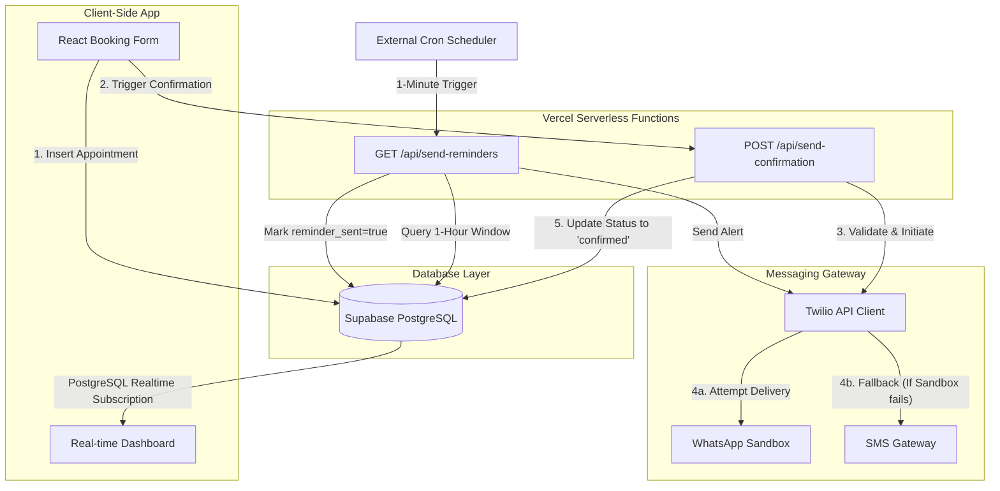

# 📱 WhatsApp & SMS Appointment Booking & Reminder System

A production-ready, full-stack appointment booking and reminder application. It features a real-time responsive dashboard, instant automated confirmations via Twilio (with fallback SMS delivery), and a background cron job for sending upcoming appointment alerts.

This repository is designed with **security best practices, enterprise architecture patterns, and clean code principles** to show how modern web technologies scale.

---

## 🏗️ Architecture & Data Flow

Below is the architectural representation of how the application operates:



---

## 🛠️ Tech Stack & Key Choices

* **Frontend**: **React 18** built on **Vite** for optimized fast builds. Custom responsive **CSS** using CSS variables for clean dark/light mode toggles.
* **Database**: **Supabase (PostgreSQL)** leveraging Postgres Realtime Engine to push database mutations straight to the UI.
* **Messaging APIs**: **Twilio API** supporting multi-channel messaging.
* **Backend Runtime**: **Vercel Serverless Functions (Node.js/ESM)** for building lightweight, scalable APIs.

---

## 🔒 Professional Engineering & Security Practices

When reviewing this codebase, the hiring manager should pay attention to these design choices:

### 1. Zero-Trust API Key Security
* **Client-Side Isolation**: The React frontend only exposes non-sensitive environment variables prefixed with `VITE_` (`VITE_SUPABASE_URL`, `VITE_SUPABASE_ANON_KEY`). Client-side read/write operations are secure and guarded by Supabase policies.
* **Secret Containment**: Twilio credentials (`TWILIO_ACCOUNT_SID` & `TWILIO_AUTH_TOKEN`) are kept strictly server-side. They are never compiled into the client bundle and are accessed only within secure Vercel Serverless Functions (`/api/*`).
* **Environment Protection**: A `.gitignore` rule is configured to ensure that local `.env` and deployment configuration files are never committed to version control.

### 2. Reliable Delivery: Fallback Pattern
In `api/send-confirmation.js`, the messaging logic implements a fallback mechanism:
1. It attempts to send a high-priority **WhatsApp message** (the primary channel).
2. If delivery fails (e.g., the recipient number has not accepted the Twilio Sandbox join request, or WhatsApp is unreachable), it catches the exception, logs it, and immediately routes the alert as a standard **SMS**.
3. If both fail, it reports a structured error upstream without crashing the serverless instance.

### 3. PostgreSQL Real-time Sync
Instead of running continuous client-side polling, the frontend subscribes to real-time postgres changes using Supabase:
```javascript
const channel = supabase
  .channel("appointments-realtime")
  .on("postgres_changes", { event: "*", schema: "public", table: "appointments" }, () => {
    fetchAppointments(); // Automatically refreshes the UI state on Insert/Update/Delete
  })
  .subscribe();
```

### 4. Background Reminder System
The reminder background process runs inside `/api/send-reminders.js`. It queries upcoming appointments in a strict sliding window time range:
* It looks for appointments due in the next **65 minutes** that have not yet had a reminder sent (`reminder_sent = false`).
* Pushes out notifications and updates the database row instantly to ensure **exactly-once** messaging delivery.

---

## 📁 Repository Directory Structure

```
.
├── api/
│   ├── send-confirmation.js    # POST: Processes new appointments & dispatches confirmations
│   └── send-reminders.js       # GET/POST: Queries upcoming events & dispatches alerts
├── src/
│   ├── App.jsx                 # React UI entry point, form logic, and dashboard
│   ├── App.css                 # Custom styles, styling themes, and glassmorphic UI variables
│   ├── main.jsx                # React bootstrapper
│   └── supabaseClient.js       # Supabase client singleton setup
├── supabase/
│   └── migrations/
│       └── 001_create_appointments.sql  # Database schema definition script
├── vercel.json                 # Vercel deployment configuration
├── vite.config.js              # Vite application config
├── .env.example                # Blueprint for local configurations
├── .gitignore                  # Security filter ignoring sensitive environment properties
└── README.md                   # System documentation
```

---

ements
* **User Authentication**: Implementing Supabase Auth to enable dashboard logins and secure multi-tenant scheduling data.
* **Bi-directional Webhooks**: Processing incoming messages (e.g., text replies like "CANCEL" or "RESCHEDULE") via Twilio webhooks to allow direct booking management from WhatsApp.
* **Timezone Localization**: Enhancing fields to store user specific timezones and converting times dynamically before dispatching Twilio alerts.
